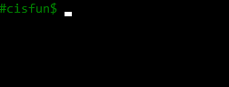

# Simple_Shell


> A simple UNIX command interpreted made by two mad guys.

---

### Table of Contents
Quick acess to

- [Description](#description)
- [How To Use](#how-to-use)
- [References](#references)
- [License](#license)
- [Author Info](#author-info)

---

## Description

First of all, a Shell in computing, is a computer program wich exposes an operating system's services to a human user or another program. In general, operating system shells use either a command-line inferface (CLI) or graphical user inferface (GUI), depending on computer's role and particular operation. It is named a shell because it is the outermost layer around the operating system.

We used Bash as our Shell father to execute our own Shell program made in C. Our Shell can handle those following tasks:
- Start reading a file  with:
	>./hsh [filename] 
- Start by 'echo' output:
	> echo "/bin/ls" | ./hsh
- Uses the PATH environment variable
- Built-ins commands
- Special characters like:
	> ", ', \, |, &, #
- Commands with arguments
- Exit built-in with arguments
- Ctrl+C shortcut
- View, Set and Unset environmental variables
- cd command
- ; command separator
- help built-in command

#### Technologies

- Bash
- C

## Table of contents

<br>

### HEADER FILES

| File  | Content |
| ------------- | ------------- |
| _our_header.h_	| This is the main header file <br> includes all next headers|
|_structs.h_| Contains all structs used	|
|_aux_functions.h_	| Contains all auxiliary functions prototypes	|
|_internal_cmds.h_	|Contains all internal commands functions prototypes	|
|_help.h_	|	Contains all internal *help* commands functions prototypes|

<br>

### Main function and entry point

| File  | Content |
| ------------- | ------------- |
| _simple_shell.c_  | The main program function <br> Functions: <div style = "color: #4dba09"> main() </div> <div style = "color: #4dba09"> infinite_loop() </div><div style = "color: #4dba09"> sighandler() </div>|

<br>

### Syntax management

| File  | Content |
| ------------- | ------------- |
| _syntax_manager.c_  | <div style = "color: #4dba09"> syntax_manager() </div> <div style = "color: #4dba09"> delete_comments() </div><div style = "color: #4dba09"> variable_translator() </div><div style = "color: #4dba09"> or_operat() </div><div style = "color: #4dba09"> and_operat() </div>|

<br>

### PRE-LAUNCH!!!

| File  | Content |
| ------------- | ------------- |
| _pre_launch.c_  | <div style = "color: #4dba09"> localize_cmd() </div> <div style = "color: #4dba09"> clean_arg() </div><div style = "color: #4dba09"> built_in_cmd() </div><div style = "color: #4dba09"> external_cmd() </div><div style = "color: #4dba09"> serch_path() </div>|

<br>

### Getline and String splitter functions

| File  | Content |
| ------------- | ------------- |
| __getline.c_  | All getline related content <br> Functions: <div style = "color: #4dba09"> _getline() </div> <div style = "color: #4dba09"> add_aux_to_fill() </div>|
| __splits1.c_  | All string splitter related content <br> Functions: <div style = "color: #4dba09"> _split() </div> <div style = "color: #4dba09"> calc_lines() </div> <div style = "color: #4dba09"> free_split() </div><div style = "color: #4dba09"> check_split_line() </div><div style = "color: #4dba09"> remove_commas() </div>|
| __splits2.c_  | Split functions part 2 <div style = "color: #4dba09"> comms_pross() </div>  |

<br>

### Auxiliary functions

| File  | Content |
| ------------- | ------------- |
| _aux_f1.c_  | <div style = "color: #4dba09"> _calloc() </div> <div style = "color: #4dba09"> _strlen() </div><div style = "color: #4dba09"> _realloc() </div></div><div style = "color: #4dba09"> _getenv() </div></div><div style = "color: #4dba09"> _atoi() </div>|
|_aux_f2.c_	|<div style = "color: #4dba09"> _strcpy() </div><div style = "color: #4dba09"> int_to_str() </div><div style = "color: #4dba09"> _strcmp() </div><div style = "color: #4dba09"> _strcon() </div><div style = "color: #4dba09"> p_strlen() </div>|
|_aux_f3.c_	|<div style = "color: #4dba09"> free_list() </div><div style = "color: #4dba09"> add_node() </div><div style = "color: #4dba09"> generate_var_nodes() </div><div style = "color: #4dba09"> check_var_delim() </div><div style = "color: #4dba09"> gen_var_content() </div>	|
|_aux_f4.c_	|<div style = "color: #4dba09"> calc_var_space() </div><div style = "color: #4dba09"> var_big_bang() </div><div style = "color: #4dba09"> copy_pstr() </div><div style = "color: #4dba09"> p_realloc() </div><div style = "color: #4dba09"> _print() </div>	|
|_aux_f5.c_	|<div style = "color: #4dba09"> get_env_index() </div><div style = "color: #4dba09"> _print_n() </div><div style = "color: #4dba09"> create_start_alias() </div><div style = "color: #4dba09"> change_command_alias() </div><div style = "color: #4dba09"> p_strcon() </div>	|
|_aux_f6.c_	|<div style = "color: #4dba09"> str_char_check() </div><div style = "color: #4dba09"> parent_wait() </div><div style = "color: #4dba09"> _magic() </div><div style = "color: #4dba09"> _setenv() </div><div style = "color: #4dba09"> counter_plus_plus() </div>	|
|_aux_f7.c_	|<div style = "color: #4dba09"> _super_con_err() </div><div style = "color: #4dba09"> get_int_env() </div><div style = "color: #4dba09"> check_dir() </div><div style = "color: #4dba09"> _print_2() </div><div style = "color: #4dba09"> _print_2_n() </div>	|
|_aux_f8.c_	|<div style = "color: #4dba09"> check_num() </div><div style = "color: #4dba09"> _set_PWD() </div>	|

<br>

### Help command functions

|File	| Content	|
| ------------- | ------------- |
| _help_f1.c_  | <div style = "color: #4dba09"> hp_help() </div> <div style = "color: #4dba09"> hp_exit() </div><div style = "color: #4dba09"> hp_cd() </div></div><div style = "color: #4dba09"> hp_alias() </div></div><div style = "color: #4dba09"> hp_env() </div>|
|_help_f2.c_	|<div style = "color: #4dba09"> hp_setenv() </div><div style = "color: #4dba09"> hp_unsetenv() </div>|

<br>

### Internal commands functions

|File	| Content	|
| ------------- | ------------- |
| _in_f1.c_  | <div style = "color: #4dba09"> cmd_exit() </div> <div style = "color: #4dba09"> cmd_env() </div><div style = "color: #4dba09"> cmd_setenv() </div></div><div style = "color: #4dba09"> cmd_unsetenv() </div></div><div style = "color: #4dba09"> cmd_cd() </div>|
|_in_f2.c_	|<div style = "color: #4dba09"> cmd_alias() </div> <div style = "color: #4dba09"> get_index_alias() </div><div style = "color: #4dba09"> cmd_help() </div></div><div style = "color: #4dba09"> cmd_oen() </div></div><div style = "color: #ba3509"> cmd_uwu() </div>|


## Special Command

try to find out what this command does:
```bash
   uwu
```

[Back To The Top](#Simple_Shell)

---

## How To Use

#### Installation
Clone this repository:
```bash
	git clone [this repository link]
```
And execute the following file:
```bash
	./hsh
```
Now you will see this:



Great! that means you done everything right.

[Back To The Top](#Simple_Shell)

---

## References
[Wikipedia - Shell](https://en.wikipedia.org/wiki/Shell_(computing))


Man pages

- [getline()](https://man7.org/linux/man-pages/man3/getline.3.html)
- [isatty()](https://man7.org/linux/man-pages/man3/isatty.3.html)
- [open()](https://man7.org/linux/man-pages/man2/open.2.html)
- [read()](https://man7.org/linux/man-pages/man2/read.2.html)
- [fork()](https://man7.org/linux/man-pages/man2/fork.2.html)

Several google reserches...

---

## License 
Copyright (c) [2021] [Hernan Montenegro, Tomas Martinez]

[Back To The Top](#Simple_Shell)

---

## Author Info
[Hernan Montenegro](https://github.com/HernanMontenegro)
[Tomás Martínez](https://github.com/tshuna332)

<br>

[Back To The Top](#Simple_Shell)
